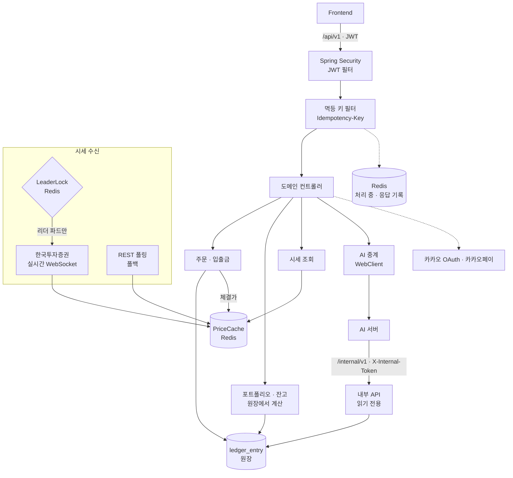

# FINCH Backend

**원장을 단일 진실 공급원으로 둔 모의 투자 서버** — [FINCH](https://github.com/Team-FINCH/finch-docs) 의 백엔드입니다.


> 담당: 서동혁 [@weeast1521](https://github.com/weeast1521)

## 아키텍처



**요청 한 건이 지나는 길** — JWT 인증 → 멱등 키로 중복 차단 → 도메인 서비스 → 원장 기록. 잔고와 손익은 저장하지 않고 원장에서 매번 계산합니다. 시세는 증권사를 직접 부르지 않고 Redis 캐시만 읽습니다.

## 설계 원칙

**1. 잔고는 저장하지 않고 계산합니다.**
잔고·손익·수익률은 모두 원장(`ledger_entry`)에서 계산합니다. 클라이언트가 보낸 계산값은 신뢰하지 않습니다.

**2. 같은 주문은 두 번 체결되지 않습니다.**
`Idempotency-Key` 필터가 매수·매도·충전·출금 요청을 Redis 에 기록해, 네트워크 재시도로 인한 중복 처리를 막습니다.

**3. AI 는 돈을 움직일 수 없습니다.**
AI 서버는 읽기 전용 내부 API 로만 원장에 접근합니다. 프론트의 AI 호출도 백엔드가 중계해 인증 주체를 하나로 둡니다.

**4. 실시간 시세 세션은 하나만 엽니다.**
증권사 실시간 세션은 계정당 한도가 있습니다. Redis 기반 `LeaderLock` 으로 여러 파드 중 리더 하나만 세션을 열고, 리더가 바뀌면 자동으로 넘겨받습니다.

## 기능

| 도메인 | 내용 |
|---|---|
| 인증 | 카카오 OAuth 로그인, JWT |
| 예수금 | 카카오페이 결제로 충전, 출금 |
| 주문 | 시장가 매수·매도, 거래 시간 검증 |
| 시세 | 한국투자증권 OpenAPI 실시간 수신(WebSocket) → 캐시, 일·주·월봉 |
| 포트폴리오 | 보유 종목, 평가손익, 매매 내역 |
| 관심·최근 본 종목, 알림함 | |
| AI 중계 | 프론트 ↔ AI 서버 요청 중계 |

## 기술 스택

Spring Boot 4.1 (Web MVC · WebFlux · WebSocket · Security · Data JPA) · Flyway · Redis · springdoc-openapi · Testcontainers

## 구조

```
src/main/java/com/finch/
├── domain/   account · auth · deposit · withdrawal · order · ledger
│             portfolio · price · stock · watchlist · recent · inbox · ai
└── global/   security · idempotency · lock · exception · config · paging
```

## 실행

```bash
./gradlew bootTestRun   # Testcontainers 가 PostgreSQL 과 Redis 를 자동으로 띄웁니다
./gradlew test
```

API 명세: [finch-docs / apiSpec.md](https://github.com/Team-FINCH/finch-docs/blob/master/docs/api/apiSpec.md)
